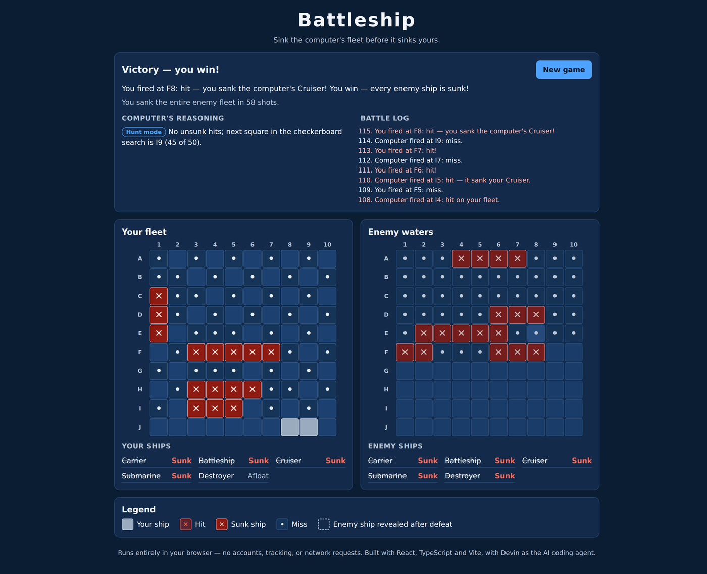
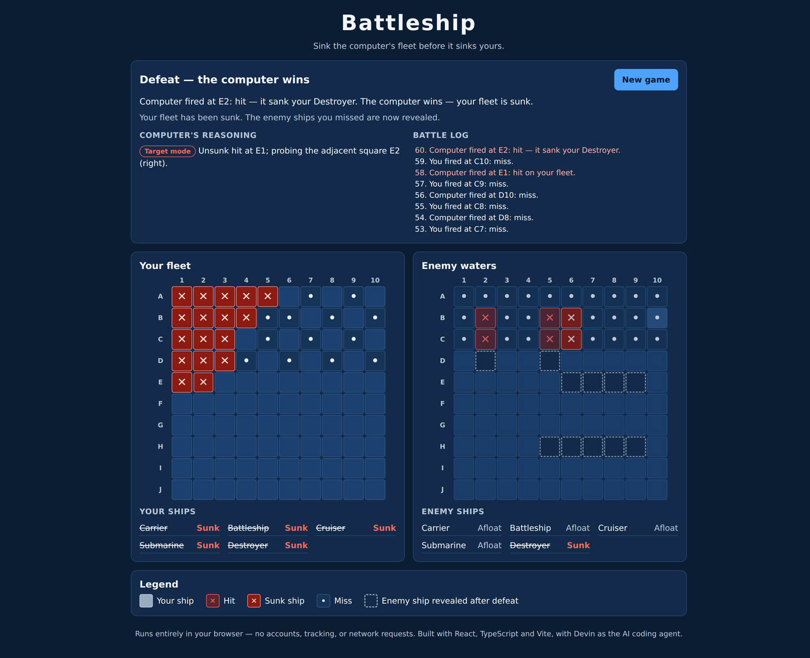
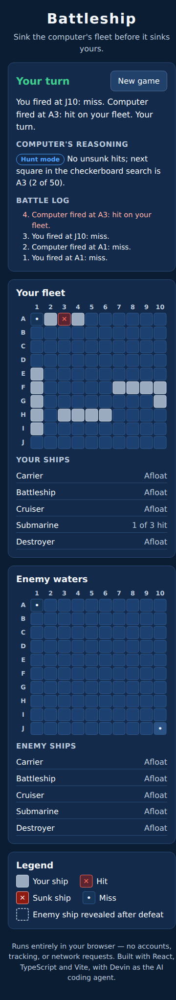
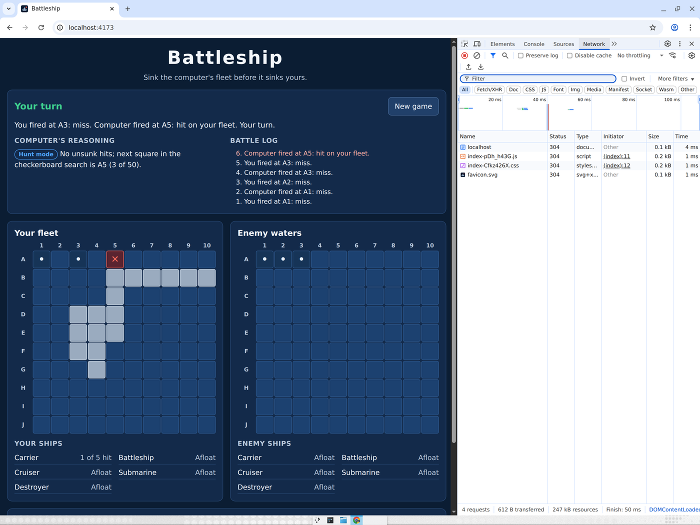

# Battleship

A polished, single-player Battleship game that runs entirely in the browser. You play against a
computer opponent whose moves are **random but explainable and repeatable**: after every shot it tells
you which mode it is in and why it chose that square, and each game's seed can replay it exactly.

**Play it live:** https://dist-oozafriw.devinapps.com

- No backend, database, accounts, analytics, external APIs, paid services, or secrets.
- The production build is a folder of static files (`dist/`) that any static host can serve.

## Screenshots

Captured during the end-to-end browser test of the production build.

| Victory | Defeat (remaining enemy ships revealed) |
|---|---|
|  |  |

| Mobile layout | Static-only: 4 same-origin requests, no external calls |
|---|---|
|  |  |

## Stack

- [React 19](https://react.dev/) + [TypeScript](https://www.typescriptlang.org/) (strict)
- [Vite](https://vite.dev/) for development and production builds
- Plain CSS (`src/App.css`)
- [Vitest](https://vitest.dev/) + [React Testing Library](https://testing-library.com/docs/react-testing-library/intro/) for tests
- [Oxlint](https://oxc.rs/docs/guide/usage/linter.html) for linting (the current Vite template default)
- GitHub Actions CI (`.github/workflows/ci.yml`)

## Local setup

Requires Node.js 20.19+ or 22.12+ (CI uses Node 22) and npm.

```bash
git clone https://github.com/abhirishi1/battleship-game.git
cd battleship-game
npm ci
```

## Commands

| Task | Command |
| --- | --- |
| Run the dev server (http://localhost:5173) | `npm run dev` |
| Run all tests once | `npm test` |
| Run tests in watch mode | `npm run test:watch` |
| Lint | `npm run lint` |
| Type-check | `npm run typecheck` |
| Production build (outputs `dist/`) | `npm run build` |
| Serve the production build locally (http://localhost:4173) | `npm run preview` |

## Rules

- Each side has a 10×10 grid (rows A–J, columns 1–10) and five ships: Carrier (5), Battleship (4),
  Cruiser (3), Submarine (3), Destroyer (2).
- Ships are placed horizontally or vertically, must stay on the board, and may not overlap or touch, not even at a corner: every ship has at least one square of water around it.
- **Placement:** pick a ship, rotate with the button or <kbd>R</kbd>, and click a square to place the
  ship's top/left end. A green preview means the ship fits; a red dashed preview explains why it
  doesn't. *Randomize fleet* places all five ships legally. *Start battle* is enabled only when all
  five ships are placed.
- **Battle:** you fire first. Each turn you fire at one square you have not tried; the computer then
  fires exactly one shot back. Results are *miss*, *hit*, or *sunk* (the sunk ship's name is
  announced, as in the board game; ordinary hits do not reveal which ship was hit).
- The first side to sink all five enemy ships wins. *New game* returns to placement at any time.
- **Scoreboard:** counts wins for you and the computer, plus games played. A game counts once, when
  it is won; a game abandoned with *New game* is not counted. *Reset scores* (with a confirmation
  step) sets everything back to 0. Scores are kept in memory for the current visit only – nothing
  is saved, so reloading the page starts again from 0.

## Architecture

```
src/
  game/                 Pure TypeScript – no React
    types.ts            Data shapes (Coord, Ship, Board, ...)
    constants.ts        Board size and the fleet
    coords.ts           Coordinate helpers ("B4" <-> { row: 1, col: 3 }, bounds checks)
    board.ts            Placement, firing, sunk/victory detection, random fleets
    ai.ts               Computer opponent (heat map, hunt/target)
    random.ts           Seeded random numbers (same seed, same game)
    scoreboard.ts       Win tally for the current visit
    game.ts             Game state + reducer: phases, turns, winner, reset
    *.test.ts           Unit tests
  components/           React UI
    Board.tsx           Accessible 10×10 grid (roving tabindex, arrow keys)
    PlacementControls.tsx, StatusPanel.tsx, FleetStatus.tsx, Scoreboard.tsx
    cellViews.ts        How each square looks / is described to screen readers
    messages.ts         Plain-English status text
  App.tsx               Wires the reducer to the UI and schedules the computer's reply
  App.test.tsx          UI tests (placement, turns, duplicate shots, win, restart, scoreboard)
```

**Separation of concerns**

- **Rules** (`board.ts`) are pure functions. Illegal placements return a reason (`out-of-bounds`,
  `overlap`, or `too-close` when ships would touch); illegal shots return `out-of-bounds` or `duplicate` and change nothing.
- **Game flow** (`game.ts`) is a single reducer, `gameReducer(state, action)`. Phases are
  `placement → battle → gameOver`. Any action that is not legal right now (firing out of turn,
  firing twice at a square, starting with an incomplete fleet, placing ships mid-battle, a second
  computer shot) returns the *same* state object, so it has no effect.
- **AI** (`ai.ts`) has its own small state and never receives the player's board – see below.
- **UI** (`components/`, `App.tsx`) only renders state and dispatches actions. The computer's reply
  is scheduled with a short delay (700 ms) so the player can follow the game; the reducer itself
  guarantees exactly one computer shot per player shot.

## Computer opponent strategy

The AI knows only what a human opponent would know: the squares it has fired at and the ordinary
result of each – *miss*, *hit*, or *sunk &lt;ship name&gt;*. Its whole memory is:

- `shots` – every square it has fired at and the result,
- `unresolvedHits` – hits not yet explained by a sunk ship, oldest first, and
- `sunkShips` – the ships it has been told it sank.

It also knows the placement rules: ships are straight and never overlap or touch, not even at a
corner.

**Heat map.** Before every shot it lists every position where each ship it has not sunk yet could
still be. A position is ruled out if it covers a miss or a square of a sunk ship, or if a hit sits
right next to it (including diagonally) without being one of its own squares, because ships never
touch. Each untried square scores the number of positions that cover it, and the AI fires at the
highest-scoring square (`countShipPositions` and `chooseShot` in `ai.ts`).

- **Hunt mode** (no unresolved hits): every possible position counts. Squares in gaps too small for
  any remaining ship, and all squares around a sunk ship, score 0 and are skipped.
- **Target mode** (some unresolved hits): only positions through those hits count. So after one hit
  it tries a neighbour in the direction with the most room (diagonal squares score 0), and after
  two hits in a line it keeps going along that line, reversing at a miss or the board edge.

When told "sunk &lt;ship&gt;", the AI knows that ship's length and removes a straight run of that
many unresolved hits containing the sinking shot (preferring runs that end at the sinking shot,
then runs containing the oldest hit). Any remaining hits belong to another ship, so it keeps
targeting them.

Each new battle gets a random **seed**. When several squares tie for the highest score, the AI
picks one at random using that seed, so games differ every time, yet the same seed and the same
results always replay exactly the same game (which is how the tests check exact behaviour).

Every shot comes with a one-line reason shown in the *Computer's reasoning* panel, e.g.
*"No unsunk hits; E5 fits a ship in 34 possible ways, the most of any untried square (picked at
random from 4 equally likely squares)."* or *"Unsunk hit at E1; D1 is part of 12 of the 22 possible
ship positions through it, the most of any square (picked at random from 2 equally likely squares)."*
A shot is never repeated: only untried squares are scored, and the reducer also rejects duplicates.
Tests play 500 complete games against random fleets to check this. In a 2,000-game simulation
against random no-touch fleets the heat-map AI needed 38.6 shots on average to win (minimum 22,
median 38, maximum 57), compared with 53.0 for the previous random checkerboard AI on the same
fleets; random firing needs about 96.

## Accessibility

- All controls are native `<button>` elements and work with the keyboard.
- Each board is a single Tab stop (`role="grid"`); the arrow keys, Home and End move between squares,
  and Enter or Space activates the focused square. Keyboard focus shows the same placement preview as
  mouse hover.
- Every square has a spoken label, e.g. "B4, miss" or "C3, your Cruiser, hit".
- Game events (results, turn changes, placement feedback, winner) are announced through a polite
  `role="status"` live region. Focus moves to the enemy board when the battle starts and to *New game*
  when it ends.
- Hits (✕), misses (•), sunk ships and previews differ in shape or border style, not only colour.
  Text and controls use high-contrast colours on a dark background, with a clearly visible yellow
  focus ring.
- Splash animations are disabled for users who prefer reduced motion. The layout stacks the boards
  on narrow screens.

## Testing

- `npm test` runs unit tests for coordinates, placement (valid, out-of-bounds, overlap, touching incl. corners), firing
  (hit, miss, duplicate, sunk), victory, reset and turn order, AI tests (heat-map scores, skipping squares
  around sunk ships, switching from hunt to target, choosing the roomier direction, following a line, never repeating a shot
  across 500 games, same seed replays the same game), scoreboard tests (a win counts once, abandoned
  games are not counted, reset, reload starts at 0), and UI tests with React Testing Library.
- Manual test cases are listed in [`docs/TEST_PLAN.md`](docs/TEST_PLAN.md).
- Defects found and fixed are recorded in [`docs/BUG_REPORT.md`](docs/BUG_REPORT.md).

## Deployment notes

- `npm run build` writes a static site to **`dist/`** – deploy that folder as-is. There is no server
  code.
- `vite.config.ts` sets `base: './'`, so asset URLs are relative and the build works at a domain root
  or in a sub-folder without changes.
- The production `index.html` includes a Content-Security-Policy meta tag (`connect-src 'none'`,
  scripts and styles from the same origin only), so the browser itself blocks any network requests
  or third-party scripts.
- CI runs `npm ci`, lint, tests and the production build on every pull request and every push to
  `main`.

## Use of Devin

Devin was used as an AI coding agent to write the code, tests and documentation. The project owner
defined the requirements, tested the application, reviewed the changes, and approved the release.
